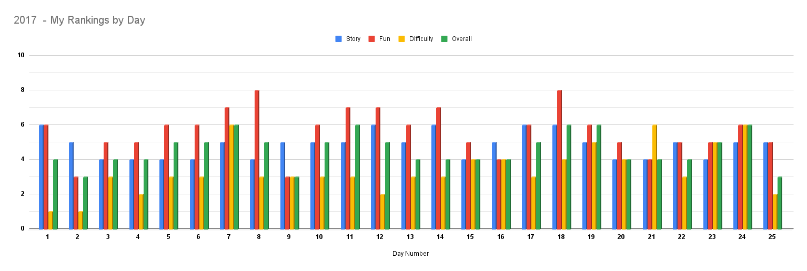

# Overall Results

I have so much optimizing I should do on this year's programs. Overall, there were only a couple of really tricky problems.
I still need to go back and actually CODE Day 11! Right now I just solved it by hand...and I don't like that...It was
definitely one of the hardest I've done so far on this.

Some of my programs take multiple minutes to run, which obviously isn't ideal. Right now, they're all done, so I'm happy
with that, but this is a year I DEFINITELY need to go back and figure out better solutions.

## Timings

I created a utility to run all of the days a given number of times and average the times to get a true average run time.
I made it so I can run just the parsing of the input data, part 1, part 2, or all of them combined so I can see a true
breakdown of how long each part of my total Advent of Code takes.

For the below, I ran each part individually and then everything together. Due to the sheer slowness of my part 2 solutions,
I only ran this 1 time...as it takes over an hour to complete all of the days. Again: I need to work on optimizing.

|              | Total Exec. Time (ms) |
|--------------|----------------------:|
| **Get Data** |                 59207 |
| **Part One** |                 20438 |
| **Part Two** |               3941774 |
| **TOTAL**    |               4076251 |

## System Details

* Python 3.10.0
* Intel(R) Core(TM) i7-6700HQ CPU @ 2.60GHz
	* 4 Cores
   * 8 Processors
* 32 GB Available memory (2133 MHz SODIMM)
* SAMSUNG MZCVKV512HAJH-OOOL1 SSD

## Daily Analysis/Breakdown

I rated each day in 4 categories:
1. **Story** - How much I enjoyed reading the puzzle and the story.
2. **Fun** - How much fun I had during the solving stage of the puzzle.
3. **Difficulty** - How difficult I thought the puzzle was. This encompasses both parts.
4. **Overall** - My overall ranking of the puzzle. This takes into account all of the above and just my general feelings on it.

