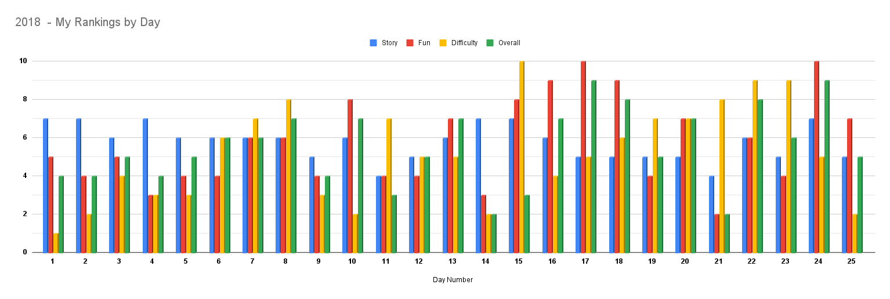

# Overall Results

As per usual, it's not exactly the most optimized code ever. This year definitely runs a little faster than previous
years, but I know of a few things to cut the time down quite a bit.

I would say overall, this year was much simpler than 2015 or 2016. There weren't really many problems that took very much
time or did anything overly complicated. There also weren't as many problems that I found "fun", and the story was a
little lackluster this year. So, overall, while it wasn't too hard to complete, it wasn't my favorite year to work through.

## Timings

I created a utility to run all of the days a given number of times and average the times to get a true average run time.
I made it so I can run just the parsing of the input data, part 1, part 2, or all of them combined so I can see a true
breakdown of how long each part of my total Advent of Code takes.

For the below, I ran each part individually and then everything together. It averages almost 3 seconds per day for part
1 and over 16 seconds for each day on part 2...so...definitely needs some improvements...

|              | Total Exec. Time (ms) |
|--------------|----------------------:|
| **Get Data** |                  3126 |
| **Part One** |                 74147 |
| **Part Two** |                165423 |
| **TOTAL**    |               4076251 |

## System Details

* Python 3.10.0
* Intel(R) Core(TM) i7-6700HQ CPU @ 2.60GHz
	* 4 Cores
   * 8 Processors
* 32 GB Available memory (2133 MHz SODIMM)
* SAMSUNG MZCVKV512HAJH-OOOL1 SSD

## Daily Analysis/Breakdown

I rated each day in 4 categories:
1. **Story** - How much I enjoyed reading the puzzle and the story.
2. **Fun** - How much fun I had during the solving stage of the puzzle.
3. **Difficulty** - How difficult I thought the puzzle was. This encompasses both parts.
4. **Overall** - My overall ranking of the puzzle. This takes into account all of the above and just my general feelings on it.

