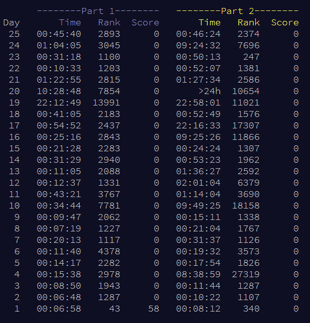

# Results

I am extremely proud of my accomplishment this year. Only one part of one puzzle took me longer than the day to complete...
and it was definitely the hardest one.

I averaged around rank 3000 for part one and around 5000 for part 2 every day...but considering my schedule and being
on EST, I'll take it. I solved the vast majority of the puzzles before going to bed...which I count as a big win.

I'm just honestly really proud of completing it this year.

# Overview
This year, I am solving all of the puzzles in Python initially. I had a lot of
fun learning it last year, but haven't had much time to continue using it regularly, so this
will give me an excuse to dive back into the language.

Each day's puzzle will have a README to talk about my approach to the puzzle and any issues I ran into. If you look
at the Python implementation's README, it will also include some stats on how many tries it took me,
how long it took me, etc.

I will be writing the execution time of all of my solutions, just because I'm curious the speed
of both different languages.

If I get around to it, I may try some other languages, like Go, Rust, or something like that.
