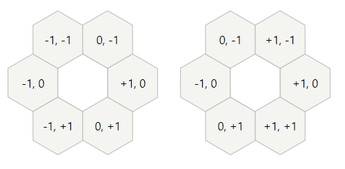

# Approach

I got a late start on this one (started around 12:40am), so I only finished part one before I went to bed.

Pretty much the entirety of this puzzle relies on coming up with a coordinate system for hexagonal tile navigation.
There are a number of options to choose from, but the one that came to my mind first was basically just using a `row`/`column`
approach, just like a 2d array...but actually "navigating" involves a couple little adjustments:

* When moving left and right directly (aka `e` or `w`), your column value increases/decreases no matter what. This is just
like normal
* When moving north (`ne` or `nw`), the row value decreases no matter what, but the column will depend on if you are on
an even row or an odd row. The column will either stay the same, increase 1, or decrease 1 depending on the direciton
and if you are on an even row or not.
* When moving south (`se` or `sw`), the row value increases no matter what, but the column will depend on if you are on
an even row or an odd row. The column will either stay the same, increase 1, or decrease 1 depending on the direciton
and if you are on an even row or not.

Here's a helpful diagram to show the coordinate differences from the center tile to each of its neighbors:

The left is in the case where the center tile is on an "even" row, and the right is if the tile is on an "odd" row.

To help with performance and readability, I utilized sets for all of the point lists, because we could use Python's
built-in set functions (`difference`, `union`, `intersect`, etc), which are really helpful.

### Part 1
> _After all of the instructions have been followed, how many tiles are left with the black side up?_

Once you have your method of traversing, you simply parse the input and actually move around. When you get to the end
of a line, add that tile to a set of tiles that need to be flipped. If that tile is already in your set, remove it
(effectively keeping it unflipped).

Then at the end, count how many positions are in your list.

### Part 2
> _How many tiles will be black after 100 days?_

This really isn't any more difficult...get your list of black tiles just like in part one. Then you visit each black tile,
get each neighbor (using the map above), and check how many of those neighbors are in the set of black tiles.
If there are zero or more than 2, then add that tile to a list of tiles tha tneed to be flipped to white.

Now, for the white tiles...we essentially have an infinite grid of almost all white iles, but since we only care about
those that have 2 adjacent black tiles, we only have to check those that are adjacent to at least 1 black tile.

Fortunately, we already have all of the neighbors of all of the black tiles. So, we loop through those, find which ones are
white, get THOSE tile's neighbors and count how many of those are black. If there are exactly 2, then add that white
tile to a list to flip back to black.

# Results

|    | Answer     | Attempts  | Exec. Time (ms) | Solve Time (HH:mm:ss) | Rank |
| ------ |-----------:| ---------:| -------------------:| ----:| ----:|
| **Part One**  | 512  | 1  | 9  | ~00:20:00  | 3045  |
| **Part Two**  | 4120  | 1  | 1800  | ~00:40:00  | 7696  |

# Original Puzzle

### --- Day 24: Lobby Layout ---
Your raft makes it to the tropical island; it turns out that the small crab was an excellent navigator. You make your
way to the resort.

As you enter the lobby, you discover a small problem: the floor is being renovated. You can't even reach the check-in
desk until they've finished installing the new tile floor.

The tiles are all hexagonal; they need to be arranged in a hex grid with a very specific color pattern. Not in the
mood to wait, you offer to help figure out the pattern.

The tiles are all white on one side and black on the other. They start with the white side facing up. The lobby is
large enough to fit whatever pattern might need to appear there.

A member of the renovation crew gives you a list of the tiles that need to be flipped over (your puzzle input). Each
line in the list identifies a single tile that needs to be flipped by giving a series of steps starting from a
reference tile in the very center of the room. (Every line starts from the same reference tile.)

Because the tiles are hexagonal, every tile has six neighbors: east, southeast, southwest, west, northwest, and
northeast. These directions are given in your list, respectively, as `e`, `se`, `sw`, `w`, `nw`, and `ne`.
A tile is identified by a series of these directions with no delimiters; for example, `esenee` identifies the tile
you land on if you start at the reference tile and then move one tile east, one tile southeast, one tile northeast,
and one tile east.

Each time a tile is identified, it flips from white to black or from black to white. Tiles might be flipped more than
once. For example, a line like `esew` flips a tile immediately adjacent to the reference tile, and a line like `nwwswee`
flips the reference tile itself.

Here is a larger example:
```
sesenwnenenewseeswwswswwnenewsewsw
neeenesenwnwwswnenewnwwsewnenwseswesw
seswneswswsenwwnwse
nwnwneseeswswnenewneswwnewseswneseene
swweswneswnenwsewnwneneseenw
eesenwseswswnenwswnwnwsewwnwsene
sewnenenenesenwsewnenwwwse
wenwwweseeeweswwwnwwe
wsweesenenewnwwnwsenewsenwwsesesenwne
neeswseenwwswnwswswnw
nenwswwsewswnenenewsenwsenwnesesenew
enewnwewneswsewnwswenweswnenwsenwsw
sweneswneswneneenwnewenewwneswswnese
swwesenesewenwneswnwwneseswwne
enesenwswwswneneswsenwnewswseenwsese
wnwnesenesenenwwnenwsewesewsesesew
nenewswnwewswnenesenwnesewesw
eneswnwswnwsenenwnwnwwseeswneewsenese
neswnwewnwnwseenwseesewsenwsweewe
wseweeenwnesenwwwswnew
```
In the above example, 10 tiles are flipped once (to black), and 5 more are flipped twice (to black, then back to
white). After all of these instructions have been followed, a total of `10` tiles are black.

Go through the renovation crew's list and determine which tiles they need to flip. After all of the instructions
have been followed, how many tiles are left with the black side up?

### --- Part Two ---
The tile floor in the lobby is meant to be a living art exhibit. Every day, the tiles are all flipped according to the
following rules:

* Any black tile with zero or more than 2 black tiles immediately adjacent to it is flipped to white.
* Any white tile with exactly 2 black tiles immediately adjacent to it is flipped to black.

Here, tiles immediately adjacent means the six tiles directly touching the tile in question.

The rules are applied simultaneously to every tile; put another way, it is first determined which tiles need to be
flipped, then they are all flipped at the same time.

In the above example, the number of black tiles that are facing up after the given number of days has passed is as follows:
```
Day 1: 15
Day 2: 12
Day 3: 25
Day 4: 14
Day 5: 23
Day 6: 28
Day 7: 41
Day 8: 37
Day 9: 49
Day 10: 37

Day 20: 132
Day 30: 259
Day 40: 406
Day 50: 566
Day 60: 788
Day 70: 1106
Day 80: 1373
Day 90: 1844
Day 100: 2208
```
After executing this process a total of 100 times, there would be `2208` black tiles facing up.

How many tiles will be black after 100 days?
