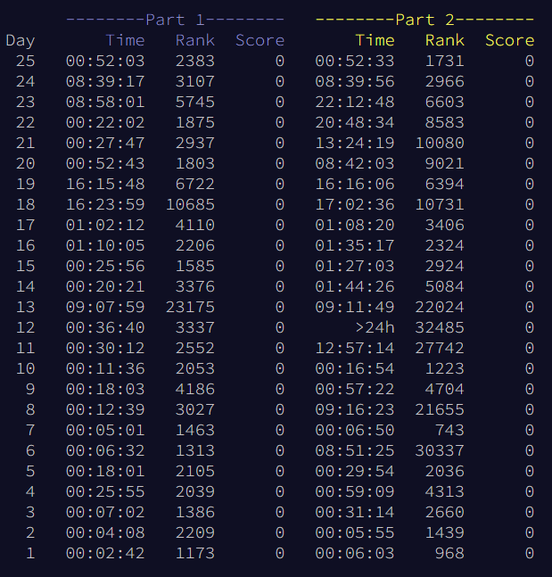

# Results

This year got difficult...I feel the last week was much harder than last year's. So the fact that I finished it, with
only one part of one puzzle taking longer than the first day (which really was just because I didn't have any time that weekend
to work on them), is something I'm quite happy with!

Unfortunately I've had a couple of things I'm not pleased with or had issues with:
1. I actually solved a couple of the puzzles with absolutely horrendous code that took forever to run, so I decided to
rewrite/refactor it. Well, as I was doing that, my IDE crashed and the computer restarted and I lost all of my revision history
on the files. So now I have code that DOESN'T work, written in a different manner than I had originally done it...so now I'm
having to redo them. I at least know HOW to solve them, but just need to get the code finished and save din github.
2. Two of the puzzles (day 23 and 24) I pretty much just did by hand and not programmatically. While I got the correct
answer(s), I'd like to figure out a better way to code them...so I'll do that eventually.

Other than that, it was all good!

# Overview
Just like other years, I am solving all of the puzzles in Python initially. I don't get much opportunity to use
it throughout the year, and I do enjoy it so much, so this challenge always gives me reason to get back into it.

Also like prior years, each day's puzzle will have a README to talk about my approach to the puzzle and any issues I ran into. If you look
at the Python implementation's README, it will also include some stats on how many tries it took me,
how long it took me, etc.

I will be writing the execution time of all of my solutions, just because I'm curious the speed
of both different languages.
